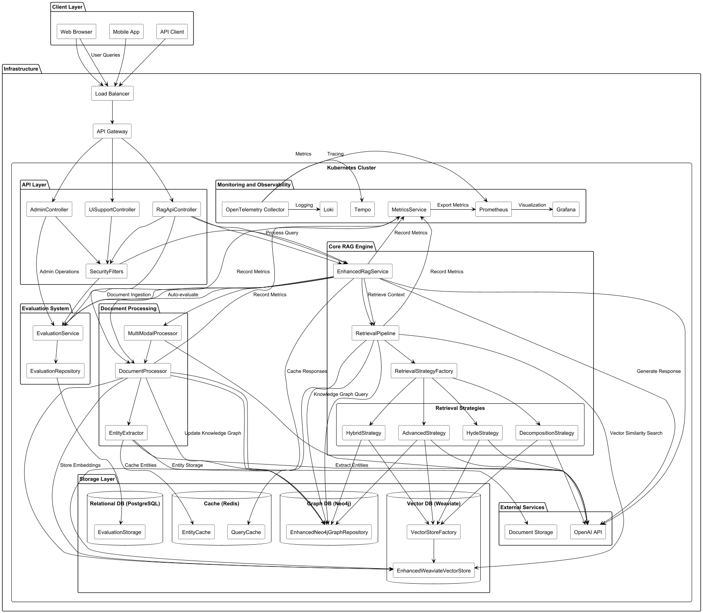

# RAG Enterprise Platform - Static Website

This is the public-facing static website for the RAG Enterprise Platform. It provides business-focused information, use cases, and technical details about the project without exposing the proprietary codebase.

## 🌐 Live Site

Once deployed, the site will be available at: `https://[your-username].github.io/[repo-name]/`

## 📁 Structure

```
site/
├── index.html              # Landing page with overview
├── project.html            # "How It Works" - Functional explanations
├── contact.html            # Contact form
├── features.html           # Redirect to project.html (legacy)
├── architecture.html       # Redirect to project.html (legacy)
├── use-cases.html          # Redirect to index.html (legacy)
├── css/
│   └── custom.css          # Custom styling
├── js/
│   └── main.js             # Interactivity
├── images/
│   ├── claracore-logo.png         # Rounded logo
│   ├── functional-architecture.svg # System architecture diagram
│   └── functional-flow.svg         # Process flow diagram
└── README.md               # This file
```

### Navigation Structure

The site has been simplified to 3 main pages:
- **Home** (`index.html`) - Overview, features preview, use cases
- **How It Works** (`project.html`) - Detailed functional explanations in plain language
- **Contact** (`contact.html`) - Get in touch form

Legacy pages (features.html, architecture.html, use-cases.html) automatically redirect to the appropriate current page.

## 🚀 Deploying to GitHub Pages

### Option 1: Create a New Public Repository (Recommended)

1. **Create a new public repository** on GitHub:
   ```
   Repository name: rag-enterprise-platform
   Description: Enterprise RAG Platform - AI-Powered Knowledge Management
   Visibility: Public ✓
   ```

2. **Copy the site contents** to the new repository:
   ```bash
   # Clone your new public repository
   git clone https://github.com/[your-username]/rag-enterprise-platform.git
   cd rag-enterprise-platform

   # Copy all files from site/ directory
   cp -r /path/to/RAG-System/site/* .

   # Commit and push
   git add .
   git commit -m "Initial static site deployment"
   git push origin main
   ```

3. **Enable GitHub Pages**:
   - Go to repository Settings → Pages
   - Source: Deploy from a branch
   - Branch: `main` / `root`
   - Click Save

4. **Wait 1-2 minutes** and visit: `https://[your-username].github.io/rag-enterprise-platform/`

### Option 2: Use a Subdirectory in Existing Repository

If you want to keep it in the same repository but make only the site public:

1. **Keep the main repository private**
2. **Create a separate public repository** just for the site (see Option 1)

**Note:** GitHub Pages requires the repository to be public, so you cannot host from a private repository on the free tier.

## 📝 Customization

Before deploying, customize these elements:

### 1. Contact Information

Edit `contact.html`:
- ✅ Already configured with mailto form action (cristigirbovan@gmail.com)
- ✅ LinkedIn URL updated (linkedin.com/in/cristigirbovan)
- Update these to your own contact details if needed

### 2. GitHub Links

Update footer links in all HTML files:
- Replace `https://github.com/cristigirbovan` with your GitHub URL
- Update LinkedIn URL

### 3. Company/Project Name

If you want to rebrand:
- Find and replace "RAG Enterprise Platform" throughout the files
- Update the gradient logo text in navigation

### 4. Add Images

Add architecture diagrams and screenshots to `images/` folder:
```bash
cp /path/to/RAG-System/docs/images/*.png images/
```

Then reference them in HTML:
```html

```

## 🎨 Content Overview

The site uses a simplified, user-friendly approach:

### index.html (Home)
- Hero section with clear value proposition
- Key metrics and benefits
- Features overview with visual cards
- Use cases preview
- Functional architecture diagram
- Technology stack highlights

### project.html (How It Works)
- Plain language explanations (no jargon)
- 3-step process overview
- 5 retrieval strategies explained with real examples:
  - Meaning-Based Search (Vector)
  - Relationship-Based Search (Graph)
  - Combined Search (Hybrid)
  - Answer-First Search (HyDE)
  - Multi-Part Search (Decomposition)
- Technology foundation
- System capabilities

### contact.html
- Contact form (mailto-based)
- Direct contact information
- LinkedIn profile link

## 🔧 Local Development

To test locally before deploying:

### Option 1: Python Simple Server
```bash
cd site
python3 -m http.server 8000
# Visit http://localhost:8000
```

### Option 2: Node.js Live Server
```bash
npx live-server site/
```

### Option 3: VS Code Live Server Extension
- Install "Live Server" extension
- Right-click `index.html` → Open with Live Server

## 📊 Analytics (Optional)

To track visitors, add Google Analytics or similar:

1. Sign up for Google Analytics
2. Get your tracking code
3. Add to the `<head>` of all HTML files:
   ```html
   <!-- Google Analytics -->
   <script async src="https://www.googletagmanager.com/gtag/js?id=G-XXXXXXXXXX"></script>
   <script>
     window.dataLayer = window.dataLayer || [];
     function gtag(){dataLayer.push(arguments);}
     gtag('js', new Date());
     gtag('config', 'G-XXXXXXXXXX');
   </script>
   ```

## 🔒 Security Notes

- ✅ No sensitive code is exposed
- ✅ No API keys or credentials
- ✅ Only public-facing documentation and information
- ✅ Contact form uses external service (Formspree)
- ⚠️ Keep the main codebase repository PRIVATE

## 📱 Mobile Responsiveness

The site uses Tailwind CSS and is fully responsive:
- Desktop: Full navigation and multi-column layouts
- Tablet: Responsive grid adjustments
- Mobile: Hamburger menu and single-column layouts

## 🎯 SEO Optimization

To improve search engine visibility:

1. **Add meta tags** to all pages:
   ```html
   <meta name="description" content="Your description here">
   <meta name="keywords" content="RAG, AI, Enterprise, Knowledge Management">
   ```

2. **Create sitemap.xml**:
   ```xml
   <?xml version="1.0" encoding="UTF-8"?>
   <urlset xmlns="http://www.sitemaps.org/schemas/sitemap/0.9">
     <url>
       <loc>https://your-username.github.io/rag-enterprise-platform/</loc>
       <priority>1.0</priority>
     </url>
     <!-- Add more URLs -->
   </urlset>
   ```

3. **Add robots.txt**:
   ```
   User-agent: *
   Allow: /
   Sitemap: https://your-username.github.io/rag-enterprise-platform/sitemap.xml
   ```

## 🚀 Next Steps

1. ✅ Review and customize all content
2. ✅ Update contact information
3. ✅ Add images and diagrams
4. ✅ Test locally
5. ✅ Create public GitHub repository
6. ✅ Deploy to GitHub Pages
7. ✅ Share the URL!

## 📞 Support

For questions about deploying this static site:
- GitHub Pages Documentation: https://pages.github.com/
- Tailwind CSS Documentation: https://tailwindcss.com/docs

---

**Last Updated:** January 2025
